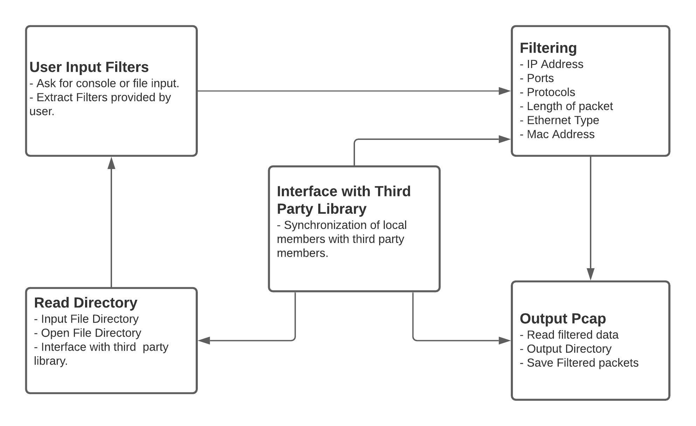

# PacketWizard

## PCAParsing

The application can parse PCAP files and provide us with information regarding transport layer, session layer, and network layer. It can provide all the unique IPV4, IPV6, TCP/UDP packet information with timestamps.

## FilterPCAP

The application filters traffic according to the filter rules provided by the user. "Pcapplusplus" library is employed for the purpose that has integration with 100+ application layer protocols.

<h3> Design </h3>

### Steps to use the filter application.

1. Download the pcapplusplus library from https://pcapplusplus.github.io/docs/install
2. Unzip the provided file for compiling the code.
3. Go to the Filtering folder.
4. There is a MakeFile available to provide configuration.
5. To compile the application (on console provide):
   a) make
   b) ./parsePCAP
6. User has the provision to give paths of folder from console and file.
7. User has to provide valid source and destination folder.
8. User has to provide filter in correct format for full working of the application.
9. The final output dump file would be stored in output folder provided by user.

Format of FilterInputFile :
First line InputDirectory
Second line OutputDirectory
Third line FilterString

#### Example:

/Users/test/PcapFiles
/Users/test/TestOutput
(protocol == UDP)

Below are the filters which are available to the user.
Various Filter formats ->

    1. IP Address

    	(ip.saddr == a.b.c.d)  ;   (ip.saddr == a:b:c:d:e:f:g:h)
    	(ip.daddr == a.b.c.d)  ;   (ip.daddr == a:b:c:d:e:f:g:h)
    	(ip.addr == a.b.c.d)  ;   (ip.addr == a:b:c:d:e:f:g:h)
    	(ip.saddr != a.b.c.d)  ;   (ip.saddr != a.b.c.d.e.f.g.h)
    	(ip.daddr != a.b.c.d)  ;   (ip.daddr != a.b.c.d.e.f.g.h)
    	(ip.addr != a.b.c.d)  ;   (ip.addr != a.b.c.d.e.f.g.h)

    2. Length of packets

    	(len == a)  ;   (len != a)   ;   (len >= a)   ;   (len <= a)   ;   (len > a)   ;   (len < a)   	;(len in a,b)

    3. MAC Address

    	(smac == a.b.c.d.e.f)  ;   (smac != a.b.c.d.e.f)
    	(dmac == a.b.c.d.e.f)  ;   (dmac != a.b.c.d.e.f)
    	(mac == a.b.c.d.e.f)  ;   (mac != a.b.c.d.e.f)

    4. Ethernet Type

    	(ether_type == a)  ;   (ether_type != a)

    5. Protocol Type

    	(protocol == a)  ;   (protocol != a)

    6. Source and Destination Port

    	(sport == a)  ;   (sport != a)   ;   (sport >= a)   ;   (sport <= a)   ;   (sport > a)   ;   (sport < a)   ;   (sport in a,b)
    	(dport == a)  ;   (dport != a)   ;   (dport >= a)   ;   (dport <= a)   ;   (dport > a)   ;   (dport < a)   ;   (dport in a,b)
    	(port == a)  ;   (port != a)   ;   (port >= a)   ;   (port <= a)   ;   (port > a)   ;   (port < a)   ;   (port in a,b)

    7. TCP Flags

    	(tcp_flags == a)  ;   (tcp_flags != a)

#### Some Examples :

1. (len <= 500) --> Correct
2. (len <= 500) && (protocol == TCP || protocol == UDP) --> (Correct)
3. dport == 556 --> (Incorrect)
4. (dport==556) --> (Incorrect)
5. (dport == 556) --> (Correct)
6. (ip.saddr == 192.168.1.1) && (protocol == TCP || dport == 443) --> (Correct)
7. (ip.addr == 192.168.1.9 || mac == 67.23.d3.c2.44.a1) --> (Correct)
